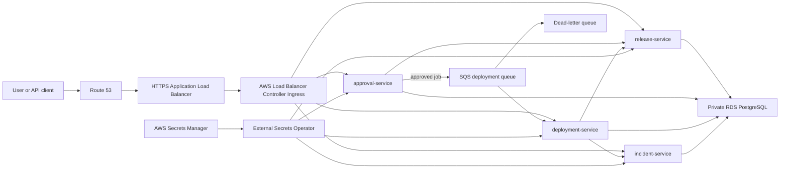
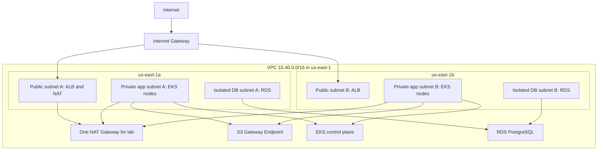
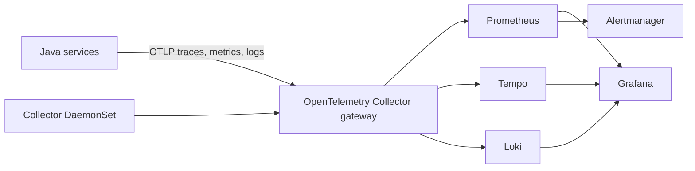

# ReleaseOps Platform Lab - Locked Master Plan

Status: LOCKED  
Locked on: 2026-07-18  
Target completion and full AWS cleanup: 2026-07-26  
Owner and learner: Tan  
Guide: Trunks

## 1. Mission

Build, operate, break, troubleshoot, and completely tear down a realistic
AWS platform for a Java release-management application.

This is not a Hello World deployment. It is a compact production-shaped system
designed to create interview-ready evidence across:

- Terraform and AWS infrastructure
- Kubernetes and EKS
- Java, Maven, Docker, and container security
- Helm packaging
- GitHub Actions CI and infrastructure delivery
- Argo CD and GitOps
- PostgreSQL on Amazon RDS
- AWS identity, secrets, and network security
- Horizontal pod and node autoscaling
- Metrics, logs, traces, dashboards, and alerting
- Failure diagnosis, rollback, cost control, and teardown

The scope below remains fixed unless Tan explicitly unlocks it, or an AWS
compatibility or cost blocker makes a small documented substitution necessary.

## 2. Honest Production-Grade Definition

"Production-grade" in this lab means we implement production patterns and can
explain their failure modes. It does not mean we pay for every production
redundancy feature for an eight-day practice environment.

Every deliberate lab compromise has a production comparison:

| Area | Cost-controlled lab | Production reference |
|---|---|---|
| NAT | One NAT Gateway | One NAT Gateway per AZ or carefully selected VPC endpoints |
| RDS | Small, Single-AZ PostgreSQL | Multi-AZ, backups/PITR, deletion protection, rotation, possibly RDS Proxy |
| EKS nodes | Small baseline plus short Spot exercise | Multi-AZ On-Demand baseline plus diversified Spot capacity |
| Observability retention | Hours or one day | Retention based on SLO, compliance, and capacity planning |
| Environments | One live `dev`; environment structure demonstrated | Isolated accounts/VPCs/states for dev, staging, and production |
| Approvals | GitHub Environment and CODEOWNERS | Separation of duties, change record, protected environment, audit integration |
| Secrets | Secrets Manager plus External Secrets | Rotation, strict KMS policy, break-glass and access review |

We will never claim that a lab compromise is the recommended production
configuration.

## 3. System We Will Build

### 3.1 Product use case

ReleaseOps is an internal platform used by engineering teams to:

1. Register a release and its immutable artifact.
2. Request approval for promotion to an environment.
3. Record approval or rejection with an audit trail.
4. Queue and track a deployment.
5. Record a failed deployment, rollback, and related incident.
6. Search release, deployment, and incident history.

This domain gives the infrastructure a reason to exist. It naturally exercises
database transactions, asynchronous messaging, identity, observability,
rollbacks, and deployment safety.

### 3.2 Java services

The application repository contains four independently deployable Java 21,
Spring Boot 3, Maven services:

| Service | Responsibility | PostgreSQL ownership | Important integration |
|---|---|---|---|
| `release-service` | Releases, versions, environments, artifact digests, release state | `release` schema and user | Called by approval and deployment flows |
| `approval-service` | Approval requests, decisions, policy result, approver audit | `approval` schema and user | Publishes approved deployment request to SQS |
| `deployment-service` | Deployment job, status, retries, rollback metadata | `deployment` schema and user | Consumes SQS; calls release and incident services |
| `incident-service` | Incident, cause, impact, rollback link, append-only audit event | `incident` schema and user | Receives failed deployment events/calls |

Required application capabilities:

- REST APIs with OpenAPI/Swagger documentation
- Bean validation and consistent error responses
- Spring Boot Actuator health, readiness, liveness, and metrics
- Flyway versioned database migrations
- Correlation and trace IDs in logs
- Timeouts, bounded retries, and circuit breaking on remote calls
- Idempotency for SQS processing
- Graceful shutdown
- Structured JSON logging
- Unit tests and integration tests with Testcontainers PostgreSQL
- Micrometer and OpenTelemetry instrumentation

The services use synchronous REST only where an immediate answer is required.
Approval-to-deployment handoff is asynchronous through Amazon SQS with a DLQ.

### 3.3 Data design

The lab uses one Amazon RDS for PostgreSQL instance to control cost. Each
service has a separate schema and database user. A service may access only its
own schema.

This is a deliberate lab compromise. In production, service-owned databases or
separate instances/clusters may be appropriate when scale, availability,
security, ownership, or lifecycle independence requires them.

RDS requirements:

- Private isolated database subnets in two AZs
- No public accessibility
- Security group permits PostgreSQL only from the EKS application security path
- Encryption at rest with KMS
- TLS from applications to PostgreSQL
- Credentials in AWS Secrets Manager
- External Secrets materializes short-lived Kubernetes Secret copies
- Flyway migrations run as an Argo CD `PreSync` Job
- Connection pool limits are sized below RDS `max_connections`
- Backup, Multi-AZ, deletion protection, rotation, RDS Proxy, and read replicas
  are discussed and represented in production notes, but expensive options are
  not kept enabled for this short lab

We do not run the business database as a Kubernetes StatefulSet. StatefulSets
and persistent volumes are still learned through the observability stack.

## 4. Architecture

### 4.1 Request and data flow



### 4.2 AWS network topology



Network decisions:

- Two public, two private application, and two isolated database subnets
- Public subnets are tagged for internet-facing load balancers
- Private application subnets are tagged for internal load balancers and EKS
- Database subnets have no route to the Internet Gateway or NAT Gateway
- One NAT Gateway is a cost-controlled lab choice
- An S3 Gateway Endpoint reduces NAT data for supported S3 paths
- Paid interface endpoints are not added by default for this short lab
- Network ACLs remain stateless guardrails; security groups provide primary
  stateful filtering

### 4.3 EKS platform

EKS configuration:

- A currently supported Kubernetes version, pinned when the EKS module is built
- Private API endpoint enabled
- Public API endpoint enabled only for the learner's current `/32` address
- EKS access entries for human/automation cluster access
- Managed node group as the stable baseline
- Karpenter Spot NodePool used for the node-autoscaling exercise
- Control-plane logs enabled during the live troubleshooting window
- Envelope encryption where supported by the selected configuration

Managed add-ons:

- Amazon VPC CNI with native NetworkPolicy support enabled
- CoreDNS
- `kube-proxy`
- EBS CSI driver
- EKS Pod Identity Agent

GitOps-managed platform add-ons:

- AWS Load Balancer Controller
- ExternalDNS
- External Secrets Operator
- Metrics Server
- Karpenter
- Kyverno
- OpenTelemetry Collector
- `kube-prometheus-stack`
- Loki and Tempo with intentionally short retention

AWS workload identity uses EKS Pod Identity where supported. GitHub Actions
uses GitHub OIDC. Static AWS access keys are forbidden.

### 4.4 Kubernetes workload design

Namespaces:

- `argocd`
- `platform-system`
- `releaseops`
- `observability`

Each application service receives:

- `Deployment`
- `ClusterIP Service`
- dedicated `ServiceAccount`
- Pod Identity association only when AWS access is required
- `ConfigMap` for non-secret configuration
- `ExternalSecret` for database or integration credentials
- startup, readiness, and liveness probes
- CPU and memory requests and limits
- HPA
- PodDisruptionBudget
- topology spread constraints and soft anti-affinity
- secure pod/container context
- default-deny NetworkPolicy plus explicit ingress and egress policy

Namespace controls:

- Pod Security Admission labels
- `LimitRange`
- `ResourceQuota`
- namespace-scoped RBAC `Role` and `RoleBinding`
- Kyverno policies: require requests/limits, disallow `latest`, require
  non-root, restrict registries, and require standard labels

Other workload types:

- Flyway migration `Job`
- stale-release report/cleanup `CronJob`
- Prometheus as a `StatefulSet` with a small EBS-backed PVC
- node telemetry collector as a `DaemonSet`

Security context baseline:

- `runAsNonRoot: true`
- read-only root filesystem where the Java runtime permits it
- writable `emptyDir` only for required temporary paths
- drop Linux capabilities
- `seccompProfile: RuntimeDefault`
- no privileged containers
- no host network, host PID, or host path

### 4.5 Container design

Each service uses an advanced multi-stage Docker build:

1. Maven dependency cache stage.
2. Compile/test/package builder stage.
3. Spring Boot layered JAR extraction.
4. Minimal Java 21 runtime stage.

Required image controls:

- pinned base-image digest
- non-root UID/GID
- OCI labels
- `.dockerignore`
- no Maven cache, source, credentials, or package manager in runtime image
- deterministic artifact version
- JVM container-awareness and memory settings
- health endpoint used by Kubernetes, not Docker Compose-only health logic
- Trivy vulnerability scan
- SBOM generation
- keyless Cosign signing in CI
- ECR immutable tags and deployment by image digest

## 5. Source Repositories

The locked target is a realistic three-repository model:

### 5.1 `releaseops-infra`

Contains:

```text
bootstrap/
infra/
  modules/
    networking/
    security/
    ecr/
    messaging/
    rds/
    eks/
    eks-addons/
    dns/
  envs/
    dev/
.github/
  actions/
  workflows/
docs/
```

Owns AWS infrastructure, IAM roles, EKS managed add-ons, and Argo CD bootstrap.

### 5.2 `releaseops-app`

Contains:

```text
pom.xml
services/
  release-service/
  approval-service/
  deployment-service/
  incident-service/
docker/
.github/
  actions/
  workflows/
docs/
```

It is a Maven multi-module monorepo. Services remain independently buildable,
versioned, containerized, and deployable. This gives realistic service
boundaries without turning a short lab into four repositories of duplicated
automation.

### 5.3 `releaseops-gitops`

Contains:

```text
charts/
  releaseops-service/
environments/
  dev/
    services/
    platform/
argocd/
  projects/
  applicationsets/
  root/
policies/
observability/
docs/
```

Owns desired Kubernetes state. One reusable `releaseops-service` Helm chart is
instantiated four times with per-service values by an Argo CD ApplicationSet.
Each service can therefore promote independently without copying templates.

For the first local phase these may be sibling directories inside the existing
lab folder. They become separate GitHub repositories before CI/CD integration.

## 6. Ownership Boundaries

To prevent Terraform and Argo CD from fighting over the same object:

| Owner | Resources |
|---|---|
| Terraform | VPC, subnets, routes, NAT, endpoints, IAM, KMS, ECR, SQS/DLQ, RDS, EKS, managed add-ons, Route 53/ACM prerequisites, Argo CD bootstrap |
| Argo CD | Namespaces, platform controllers after bootstrap, policies, observability, Helm releases, application workloads |
| Application CI | Test artifacts, images, SBOMs, signatures, ECR push, GitOps promotion PR |
| Human approval | Protected merge, infrastructure apply environment, destructive workflow confirmation |

The CI pipeline never runs `kubectl set image` and never deploys directly to
the cluster. It changes Git; Argo CD reconciles Git to Kubernetes.

## 7. Terraform Design and Deep Dive

### 7.1 State and environments

- Existing S3 backend is retained.
- S3 bucket versioning and encryption remain enabled.
- Native S3 lockfile is the active locking mechanism.
- The existing DynamoDB table is retained temporarily as a legacy-locking
  learning artifact; DynamoDB locking is deprecated and is not configured for
  new state.
- The backend is destroyed last, only after all other state-managed resources
  are gone and state is archived.
- Dev, staging, and production would use separate state and credentials.
- CLI workspaces are demonstrated in a small disposable exercise, not used as
  the security boundary between environments.

### 7.2 Module rules

- Root modules compose child modules.
- Child modules have clear inputs, outputs, assumptions, and validations.
- Modules are cohesive; no one-resource wrapper modules.
- Provider configuration stays in root modules.
- Module versions are pinned when consumed remotely.
- Module tests cover important contracts.
- Dependencies are expressed through references; `depends_on` is used only
  when Terraform cannot infer the dependency.

### 7.3 Advanced Terraform topics to practice

We will use or deliberately demonstrate:

- resources, data sources, variables, locals, and outputs
- primitive, collection, and structural types
- `object`, `map`, `set`, optional attributes, and nullable behavior
- variable validation, resource preconditions/postconditions, and check blocks
- `count` versus `for_each` and stable resource addressing
- `dynamic` blocks only where repeated nested blocks are genuinely dynamic
- `merge`, `flatten`, `zipmap`, `setproduct`, `try`, `can`, `lookup`,
  `coalesce`, `cidrsubnet`, and comprehensions
- conditional expressions
- implicit dependency graph and careful explicit `depends_on`
- lifecycle: `create_before_destroy`, `prevent_destroy`, and selective
  `ignore_changes`
- provider aliases and default tags
- sensitive values and why state must still be protected
- `terraform fmt`, `validate`, `plan`, saved plans, and `apply`
- `terraform state list/show/mv/rm` safety
- import blocks and generated configuration discussion
- moved blocks for safe refactoring
- drift detection and reconciliation
- `-replace` versus taint
- lock diagnosis and cautious `force-unlock`
- `terraform console`, graph, and provider schema inspection
- `.terraform.lock.hcl` and provider/module versioning
- `terraform test`
- TFLint, Checkov, and cost estimation

The existing count-based subnet module will be examined first. We will then
perform one controlled refactor to stable `for_each` addresses using `moved`
blocks, proving that a refactor need not recreate live subnets.

## 8. Helm and Kubernetes Packaging

The reusable Helm chart provides:

- Deployment, Service, ServiceAccount, Ingress fragments, HPA, PDB
- ConfigMap, ExternalSecret, NetworkPolicy
- migration Job and optional CronJob
- ServiceMonitor/PodMonitor
- standardized labels and annotations
- checksum annotations for configuration rollout
- values schema validation
- lab and production-reference values

Chart quality gates:

- `helm lint`
- `helm template`
- JSON schema validation
- `kubeconform`
- chart-testing
- policy checks

No plain-text secret appears in Git or a Helm values file.

## 9. Delivery Pipelines

### 9.1 Infrastructure pull-request pipeline

On a pull request:

1. Detect changed Terraform roots.
2. Run format check.
3. Initialize without applying.
4. Validate.
5. Run TFLint.
6. Run Checkov.
7. Run Terraform tests.
8. Create a speculative plan with a read-only plan role.
9. Generate cost delta.
10. Publish a sanitized plan summary to the pull request.

Controls:

- GitHub OIDC, never stored AWS keys
- exact trust conditions for repository, branch, and environment
- least-privilege plan and apply roles
- workflow permissions minimized
- actions pinned to immutable commit SHAs
- dependency updates through Dependabot/Renovate
- concurrency prevents parallel applies to one state
- CODEOWNERS and protected branch

### 9.2 Infrastructure apply pipeline

After merge:

1. Re-run validation and policy checks.
2. Re-create the plan against the current state.
3. Enter a protected GitHub Environment.
4. Require approval.
5. Save the exact plan artifact.
6. Apply that saved plan.
7. Publish outputs and audit summary.

A scheduled drift workflow runs a refresh-only/speculative plan and opens an
issue or fails visibly. It does not blindly auto-remediate production drift.

### 9.3 Application CI pipeline

On a service change:

1. Detect affected Maven modules.
2. Run compile, unit tests, integration tests, and `mvn verify`.
3. Enforce JaCoCo coverage.
4. Run formatting/static analysis and dependency checks.
5. Run Sonar quality gate.
6. Build changed services in a matrix.
7. Scan images with Trivy.
8. Generate SBOM and provenance.
9. Sign images with keyless Cosign.
10. Authenticate to AWS using GitHub OIDC.
11. Push immutable image tags to ECR.
12. Open a GitOps pull request changing the service image digest.

The lab may use a fine-grained token to open the cross-repository PR. The
production reference is a GitHub App with narrowly scoped, short-lived tokens.

### 9.4 GitOps continuous delivery

- Terraform installs the Argo CD bootstrap only.
- A root Application installs platform and workload Applications.
- An ApplicationSet generates four service Applications.
- An AppProject restricts repositories, destinations, and resource kinds.
- Dev uses automated sync, prune, and self-heal.
- Critical resources use prune confirmation.
- Sync waves order namespaces/policies, controllers, database migration, apps,
  and observability.
- Flyway is a `PreSync` hook with a clear cleanup policy.
- Sync windows demonstrate change freezes.
- Rollback is performed by reverting the Git change so desired state and live
  state remain aligned.

## 10. Security Plan

Identity:

- GitHub OIDC to AWS with exact `aud` and `sub` trust conditions
- EKS access entries for people and automation
- EKS Pod Identity for AWS-aware workloads
- separate ServiceAccounts per service
- least-privilege IAM and Kubernetes RBAC

Secrets:

- AWS Secrets Manager is the source of truth
- KMS encryption
- External Secrets Operator syncs into Kubernetes
- secrets are masked in CI and excluded from logs
- no secrets in Terraform output, Helm values, Git, or container layers
- rotation and application refresh behavior are tested conceptually

Supply chain:

- pinned dependencies and actions
- image vulnerability scanning
- SBOM
- image signing and verification discussion
- ECR immutable tags
- deploy by digest
- Kyverno registry and image policy

Runtime:

- default-deny NetworkPolicy
- Pod Security Admission
- non-root, dropped capabilities, seccomp, read-only filesystem
- resource controls
- no public RDS
- TLS at ALB and PostgreSQL

## 11. Autoscaling

Pod scaling:

- Metrics Server supplies resource metrics.
- HPA scales a selected service on CPU and optionally memory.
- Requests are mandatory because utilization-based HPA needs them.
- A controlled load test demonstrates scale-out and scale-in.

Node scaling:

- Karpenter provisions a short-lived Spot node for unschedulable pods.
- NodePool requirements constrain architecture, capacity type, instance
  categories, and zones.
- Disruption budgets and consolidation are configured.
- PodDisruptionBudget and `do-not-disrupt` interactions are examined.
- The Spot NodePool is removed or scaled to zero immediately after the drill.

Interview chain to explain:

`requests -> scheduler -> Pending pods -> Karpenter -> node -> HPA capacity`

## 12. Observability

Telemetry path:



Required evidence:

- Golden signals dashboard: latency, traffic, errors, saturation
- JVM heap, GC, thread, and Hikari connection pool dashboard
- Kubernetes pod, node, restart, and resource dashboard
- RDS connections, CPU, storage, and latency view
- one trace across at least three services and SQS processing
- logs searchable by trace/correlation ID
- alerts for service down, high error rate, high latency, restarts,
  connection-pool pressure, and failed Argo sync

Retention and replicas stay deliberately small. The full stack is installed
only for the observability exercise and removed early if cost/capacity requires.

## 13. Mandatory Failure and Troubleshooting Drills

For every drill we record symptoms, hypothesis, commands, root cause, fix,
prevention, and a two-minute interview answer.

| # | Failure injected | Diagnostic focus | Expected fix |
|---|---|---|---|
| 1 | Stale Terraform state lock | lock owner, concurrent run, backend | stop competing run; force-unlock only after proof |
| 2 | Manual AWS tag/config drift | refresh plan, ownership | reconcile code or deliberately import/ignore |
| 3 | `count` to `for_each` refactor | state addresses | `moved` blocks without recreation |
| 4 | Private node has no egress or DNS | routes, NAT, SG/NACL, CoreDNS | correct route/DNS/security path |
| 5 | GitHub OIDC `AssumeRole` denied | token claims and trust policy | exact `aud`/`sub`, environment, permissions |
| 6 | EKS access denied | access entries and RBAC | correct AWS access entry and Kubernetes authorization |
| 7 | Node NotReady or CNI IP pressure | node, CNI logs, subnet IPs | CNI/config/capacity correction |
| 8 | `ImagePullBackOff` | image name, digest, architecture, ECR auth | publish correct image and identity |
| 9 | `CrashLoopBackOff` or probe loop | logs, events, probes, config | fix startup/probe/configuration |
| 10 | Pod Pending | requests, quota, taint, affinity, PVC | capacity or scheduling constraint correction |
| 11 | `OOMKilled` or CPU throttling | limits, JVM, metrics | resize resources/JVM and load test |
| 12 | NetworkPolicy blocks DNS/RDS | policy selectors and flow | explicit DNS and database egress |
| 13 | ExternalSecret `AccessDenied` | Pod Identity/IAM/KMS | narrow but sufficient permissions |
| 14 | RDS timeout or connection exhaustion | SG, DNS, TLS, pool, `max_connections` | correct path and pool sizing |
| 15 | ALB 502/503 or unhealthy target | Ingress, Service, ports, target health | align health check and endpoints |
| 16 | HPA shows unknown metrics | Metrics Server and requests | repair metrics and requests |
| 17 | Karpenter cannot drain/provision | NodePool, PDB, limits, Spot availability | adjust constraints/disruption safely |
| 18 | Argo CD OutOfSync or sync-wave deadlock | diff, hook, CRD, health | correct Git/order/health, then resync |
| 19 | Bad release needs rollback | Git history and immutable digest | revert Git promotion commit |
| 20 | Missing cross-service trace | propagation headers and OTEL pipeline | restore instrumentation/collector route |

Drills 1-12 are mandatory hands-on. Drills 13-20 are hands-on where time permits
and otherwise performed as command-led scenario walkthroughs.

## 14. Interview Curriculum

### Terraform

- How state, locking, refresh, plan, and apply work
- Why state is sensitive
- Backend bootstrap chicken-and-egg problem
- `count` versus `for_each`
- module design and versioning
- workspaces versus separate state/accounts
- lifecycle and dependency mistakes
- import, moved blocks, drift, and refactoring
- pipeline safety and saved plans

### AWS and networking

- public, private, and isolated subnets
- route tables, IGW, NAT, endpoints, SGs, and NACLs
- EKS control plane versus data plane
- RDS Multi-AZ versus read replica
- IAM trust policy versus permission policy
- OIDC and workload identity
- encryption, secrets, DNS, TLS, and load balancing
- HA, failure domains, RTO, RPO, and cost trade-offs

### Kubernetes

- Pod lifecycle, probes, scheduling, controllers, and Services
- Deployment versus StatefulSet versus DaemonSet versus Job/CronJob
- requests, limits, QoS, OOM, throttling, quotas, and LimitRange
- HPA, PDB, topology spread, taints, affinity, and Karpenter
- RBAC, ServiceAccount, Pod Identity, NetworkPolicy, and Pod Security
- Ingress, DNS, CNI, CSI, PVC, and common failure states

### Delivery and GitOps

- CI versus continuous delivery versus continuous deployment
- artifacts, provenance, SBOM, signing, and immutability
- environment approvals and separation of duties
- push deployment versus pull reconciliation
- Argo CD sync, prune, self-heal, hooks, waves, projects, and rollback
- drift ownership between Terraform and Argo CD

### Observability and operations

- metrics versus logs versus traces
- RED, USE, golden signals, SLIs/SLOs
- alert symptoms versus root cause
- trace context and asynchronous messaging
- incident response, rollback, postmortem, and prevention

### Honest story format

Interview answers must say:

> "In my ReleaseOps lab, I designed and tested..."

They must not imply unearned production employment experience. A strong answer
uses:

1. Context
2. Risk or failure
3. Evidence gathered
4. Decision and trade-off
5. Verification
6. Prevention or production improvement

Core stories to prepare:

- safe Terraform state and approval flow
- OIDC replacing static credentials
- NetworkPolicy accidentally blocking a dependency
- RDS connectivity or pool exhaustion
- GitOps drift and rollback
- HPA/Karpenter scaling and disruption
- observability-led diagnosis
- cost-controlled teardown

## 15. Learning and Type-Along Contract

Tan types or intentionally copies the infrastructure, Kubernetes, Helm, and
pipeline code. Trunks writes the Java application code and later generates the
notes.

Each guided block must contain:

1. Goal in plain English.
2. Exact directory and file.
3. A small code block, not an entire completed module.
4. Line-by-line explanation at learner level.
5. Why the choice exists.
6. Production difference or gotcha.
7. One interview question and speakable answer.
8. Exact validation command.
9. Expected result.
10. A checkpoint before the next block.

The guide must not pre-write future learner-owned modules. It may inspect and
debug the learner's work. It may directly edit only when Tan explicitly asks,
or when recovering from an agreed blocker.

## 16. Fixed Milestones and Latest Dates

These are outcome milestones, not rigid daily hour quotas. Tan may finish
earlier. Expensive infrastructure should exist for the shortest possible
window.

| Latest date | Milestone | Expensive AWS resources |
|---|---|---|
| Jul 18 | Plan locked; current backend and VPC verified | Current VPC only |
| Jul 19 | Networking hardening; DB subnets; `for_each`/moved exercise; module tests | No EKS/RDS yet |
| Jul 20 | IAM, ECR, SQS/DLQ, KMS, Secrets, RDS/EKS module code and plans | Prefer plan-only |
| Jul 21 | Java app generated; local tests; Docker and Maven CI understood | No EKS/RDS required |
| Jul 22 | Helm/GitOps structure; policy manifests; pipeline dry runs | No EKS/RDS required |
| Jul 23 | Apply RDS and EKS; bootstrap Argo CD and controllers | Live cost window begins |
| Jul 24 | Deploy four services; RDS migration; HTTPS domain; security controls | Live |
| Jul 25 | CI/CD, autoscaling, observability, mandatory drills, rollback | Live |
| Jul 26 | Final drills, interview notes, evidence, and verified teardown | All costly resources removed |

If the week becomes busy, preserve the July 26 teardown by moving local/offline
work earlier and reducing idle live time, not by deleting core learning scope.

## 17. Cost Guardrails

1. EKS, NAT, RDS, ALB, and EC2 nodes are not created until their exercise is
   ready.
2. Target live window is approximately 72 hours; 96 hours is the hard warning.
3. Use one NAT Gateway for the lab and remove it immediately at teardown.
4. Start with the smallest practical RDS class and storage.
5. Keep a minimal managed node group; use Spot only during the scaling drill.
6. Install heavy observability components late and use short retention.
7. Use one shared ALB and host/path routing.
8. Create an AWS Budget and billing alarm before the expensive apply.
9. Tag every resource with Project, Environment, Owner, ManagedBy, and
   AutoDeleteAfter.
10. Run a daily resource and estimated-cost inventory while live.

Planning envelope, not a billing guarantee:

- Preferred 72-hour live window: roughly USD 20-30 before tax
- 96-hour live window: roughly USD 28-40 before tax
- Safety ceiling for the lab: USD 45 before tax

Actual cost depends on region, data transfer, image pulls, log volume, instance
choice, AWS credits/free-tier eligibility, and resources accidentally left
running.

## 18. Teardown Runbook

Teardown is part of the project, not housekeeping.

Order:

1. Disable or pause workflows that can recreate infrastructure.
2. Disable Argo CD auto-sync where needed.
3. Delete workload Applications and Ingresses.
4. Wait until ALB, listeners, target groups, and related security groups are
   gone.
5. Delete application PVCs/EBS volumes and Karpenter NodeClaims.
6. Delete GitOps-managed add-ons in dependency order.
7. Run Terraform plan for destroy and review it.
8. Destroy EKS, nodes, RDS, NAT, EIP, SQS, ECR, KMS-managed resources, secrets,
   and networking.
9. Verify in AWS that no billable lab resources remain.
10. Preserve the purchased domain and existing hosted zone. Remove only the lab
    DNS records and certificate resources created for ReleaseOps.
11. Archive final Terraform state and outputs without secrets.
12. Destroy backend bootstrap resources last. Empty all S3 object versions and
    remove `prevent_destroy` only as an explicit final action.

Verification checklist:

- no EKS clusters or managed node groups
- no EC2 instances, Auto Scaling groups, Karpenter nodes, or launch templates
- no NAT Gateway or unattached Elastic IP
- no RDS instance, unexpected retained snapshot, or RDS Proxy
- no ALB/NLB, listener, target group, or orphan security group
- no EBS volume or snapshot created by the lab
- no SQS queue/DLQ
- no ECR image storage unless intentionally retained
- no Secrets Manager secret pending unexpected paid retention
- no unexpected CloudWatch log groups
- no lab Route 53 record
- no forgotten KMS key outside its documented deletion schedule
- backend bucket and lock resources removed last

## 19. Definition of Done

The project is complete only when all statements are true:

- Four Java services build and pass tests.
- Images are scanned, have SBOMs, are signed, pushed to ECR, and referenced by
  digest.
- The public API works over HTTPS on the chosen domain.
- Applications use private RDS and survive pod restarts without data loss.
- SQS processing and DLQ behavior are demonstrated.
- Terraform modules and pipelines pass their quality gates.
- GitHub Actions uses OIDC and protected apply approval.
- Argo CD deploys from Git, prunes/self-heals in dev, and rolls back by Git
  revert.
- ServiceAccounts, identity, RBAC, secrets, NetworkPolicies, Pod Security,
  quotas, LimitRanges, resources, probes, HPA, PDB, and topology controls are
  visible and explained.
- Karpenter scale-out and scale-in are observed.
- Metrics, logs, and traces show one complete business flow.
- At least the first 12 failure drills are completed and documented.
- Interview notes, runbooks, architecture decisions, and question bank exist.
- All lab-created billable AWS resources are verified absent by July 26.

## 20. Explicit Non-Goals

To protect time and cost, this locked lab will not add:

- a frontend SPA; API and Swagger UI are sufficient
- Kafka, MSK, service mesh, or multi-cluster federation
- four separate RDS instances
- active-active multi-region deployment
- Terraform Cloud/HCP as a required runtime
- a permanent self-hosted SonarQube server in EKS
- full chaos-engineering tooling
- email as an approval authority
- long-lived production data or monitoring retention

These can be discussed as extensions after the July 26 teardown, but they do
not enter the current build.

## 21. Codex Model and Credit Strategy

Recommendation checked on 2026-07-18:

| Work type | Preferred setting | Why |
|---|---|---|
| Daily type-along, explanations, small Terraform/Helm steps | GPT-5.6 Terra, Medium | Best balance for sustained tool work and reasoning |
| Architecture, difficult state refactor, unclear EKS/RDS failure, final review | GPT-5.6 Sol, High | Use deeper judgment only where it changes the result |
| Formatting notes, extracting commands, repetitive status updates | GPT-5.6 Luna, Low or Medium | Clear task with lower credit use |

If the model picker offers only GPT-5.4 and GPT-5.5:

- Use GPT-5.4 Medium for most guided lab steps.
- Switch to GPT-5.5 High for architecture review, a genuinely difficult
  multi-layer failure, or final interview drills.
- Return to GPT-5.4 Medium after the difficult checkpoint.

Do not run the entire lab at Extra High, Max, or Ultra. Higher reasoning uses
more time and tokens. Most type-along steps are well-defined once this plan is
locked. The plan files, status ledger, small checkpoints, and command output
provide continuity; the most expensive model does not need to hold the project
in memory.

Model changes must never change architecture, ownership, teaching rules, or
scope. Every model starts by reading `AGENTS.md`, this file, and
`PROJECT_STATUS.md`.

## 22. Change-Control Rule

This document is the source of truth.

A change requires one of:

1. Tan explicitly says, "unlock the plan and change X."
2. A verified provider/AWS/Kubernetes incompatibility blocks implementation.
3. A verified cost risk threatens the July 26 teardown target.

Any allowed change must be recorded in `PROJECT_STATUS.md` with:

- date
- old decision
- new decision
- reason
- scope and cost impact
