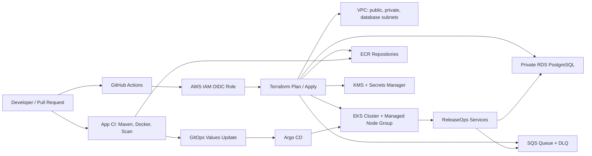

# Client Interview Prep Index

This file is the Sunday-night revision map. Read it when you do not want to
wander through the repo randomly.

## One-Minute Project Story

ReleaseOps is a production-shaped release-management platform on AWS.

The infrastructure is managed by Terraform. The application platform runs on
EKS. Application data lives in private RDS PostgreSQL, container images live in
ECR, async deployment work flows through SQS and a DLQ, and GitHub Actions uses
OIDC to access AWS without long-lived keys. Kubernetes guardrails include
namespaces, service accounts, quotas, limits, Helm packaging, NetworkPolicy,
PDBs, HPA, and Argo CD GitOps references.

Say it like this:

> I built a compact EKS platform that mirrors a real enterprise delivery
> workflow. Terraform provisions AWS primitives such as VPC, private subnets,
> RDS, ECR, SQS, IAM OIDC, and EKS. Kubernetes runs the application layer with
> least-privilege service accounts, resource controls, Helm packaging, and
> GitOps delivery. I also documented operational troubleshooting, cost controls,
> and cleanup because production DevOps is not just provisioning; it is keeping
> systems secure, recoverable, observable, and affordable.

## What To Study First

1. `docs/24-cicd-release-gitops-deep-dive.md`
   Start here now that the Kubernetes core pass is complete. It explains CI,
   release integrity, GitHub Actions, Jenkins, Shared Libraries, GitOps, Argo
   CD, approval, rollback, and database-safe delivery from zero.

2. `docs/25-cicd-troubleshooting-playbook.md`
   Use the symptom-driven pipeline and deployment scenarios immediately after
   each CI/CD section.

3. `PROJECT_STATUS.md`
   Read this so you know what was actually applied and what is reference-only.

4. `docs/14-helm-gitops-cicd-deep-dive.md`
   Connect CI/CD to the actual chart and Argo CD files in this repository.

5. `docs/22-kubernetes-core-deep-dive.md`
   Revisit vendor-neutral Kubernetes after the CI/CD pass.

6. `docs/23-kubernetes-troubleshooting-playbook.md`
   Revisit the Kubernetes symptom-driven scenarios.

7. `docs/10-eks-foundation-deep-dive.md`
   Read this later if the role specifically requires managed Kubernetes or EKS.

8. `docs/11-eks-addons-troubleshooting.md`
   This contains the real failed add-on troubleshooting story.

9. `docs/15-scenario-drills-and-gotchas.md`
   Read this like mock interview flashcards.

10. `docs/16-python-devops-angles.md`
   Use this to answer "where did you use scripting?" confidently.

11. `docs/17-final-command-walkthrough.md`
   This is the minimum command set to revise before the interview.

## Architecture Diagram

## Interview Positioning

For a banking/client interview, do not present this as "I made a cluster."
Present it as "I designed a controlled delivery platform."

Stress these themes:

- least privilege IAM instead of static AWS keys
- private database access instead of public RDS
- separated Terraform and GitOps ownership
- deterministic CI checks before apply/deploy
- cost awareness and teardown discipline
- failure drills and operational runbooks
- audit-friendly changes through PRs

## What Not To Overclaim

Be honest and crisp:

- The Java services are reference architecture, not a full business product.
- The Helm/GitOps layer is a reference implementation for interview prep.
- The GitHub Actions reusable workflows and Jenkins Shared Library are
  locally reviewed reference implementations; they were not run against a
  complete application repository or live Jenkins controller.
- The AWS infra was built hands-on up to EKS, add-ons, RDS, ECR, SQS, OIDC, and
  platform guardrails.
- Observability is designed and documented; full Prometheus/Grafana rollout can
  be a next improvement if time allows.

This honesty makes the story stronger, not weaker.
