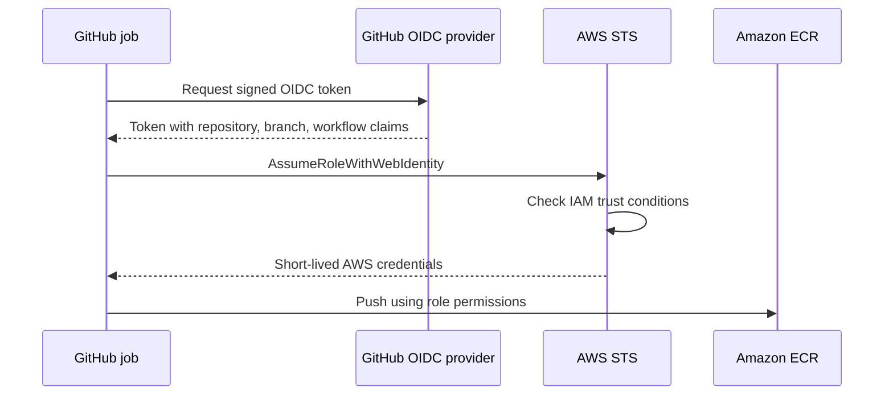
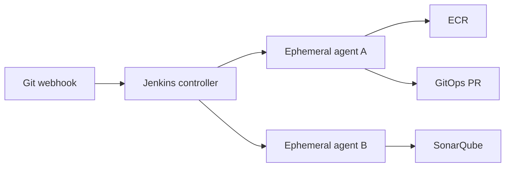

# Production CI/CD, Release, And GitOps Deep Dive

This chapter starts from zero and then moves to production design. Read it in
order the first time. During interview revision, use the bold definitions,
decision tables, and speakable answers.

## 1. What Exists In This Repository

The repository contains a production-shaped reference plus one compact Java
`release-service` so the application pipeline has a real Maven build target.
Some deployment steps are still reference paths because no live Argo CD
promotion has been run from this workflow.

| Area | Reference | Current truth |
| --- | --- | --- |
| Terraform PR validation | `.github/workflows/infra-pr.yml` | Credential-free static validation exists |
| Trusted Terraform plan | `.github/workflows/infra-plan-reference.yml` | Manual main-branch reference exists; not dispatched here |
| App CI/CD caller | `.github/workflows/app-ci-reference.yml` | PR validation, main-branch image publish, and dev GitOps promotion wiring |
| Java service CI | `.github/workflows/reusable-java-service-ci.yml` | Reusable Maven verify, optional Sonar, ECR publish, and Trivy scan workflow |
| GitOps promotion | `.github/workflows/reusable-gitops-promotion.yml` | Opens a GitOps PR with the immutable image digest |
| Composite action | `.github/actions/release-metadata/action.yml` | Real reusable metadata logic |
| Jenkins | `jenkins/` | Study reference; no Jenkins controller is connected |
| Helm validation | `.github/workflows/gitops-validate.yml` | Workflow code exists |
| Argo CD | `gitops/argocd/` | Desired-state reference; not installed by these workflows |

This distinction is interview-safe:

> I built a production-shaped CI/CD and GitOps reference. Application PRs run
> Maven validation, main-branch app changes can publish an immutable ECR image,
> and deployment is proposed through a GitOps PR. I can explain the execution
> model and failure handling, but I do not claim that the reference Jenkins
> pipeline was executed on a live controller.

### Current Automated App CI/CD Chain

When a developer opens a pull request that changes application files, this
workflow starts:

```text
.github/workflows/app-ci-reference.yml
```

For a pull request, it calls:

```text
.github/workflows/reusable-java-service-ci.yml
```

and runs the `verify` job:

```text
checkout code
setup Java 21
cache Maven dependencies
mvn clean verify
upload test reports
```

On a pull request, the pipeline does **not** push an image to ECR. The reason is
simple: PR code should prove it builds and tests cleanly before it receives
release privileges.

When application code is pushed to `main`, the same caller workflow runs again,
but now it enables image publishing:

```text
main branch app change
  -> Application CI/CD
  -> reusable Java CI
  -> Maven verify
  -> GitHub OIDC to AWS
  -> ECR login
  -> release metadata action
  -> Docker build and push
  -> Trivy image scan
  -> image digest output
```

If the image was built and a digest exists, the workflow then calls:

```text
.github/workflows/reusable-gitops-promotion.yml
```

That promotion workflow updates:

```text
gitops/environments/dev/services/release-service-values.yaml
```

with the new immutable image digest, then opens a GitOps pull request.

After that, deployment is intentionally Git-based:

```text
promotion PR opened
  -> GitOps validation runs
  -> human review and merge
  -> Argo CD sees Git changed
  -> Argo CD syncs Kubernetes
```

The important interview point:

> CI builds and scans the artifact. CD does not run `kubectl apply` from the
> CI runner. CD proposes a GitOps change. Argo CD is the component that applies
> the desired state to Kubernetes.

### Current Trigger Matrix

| Developer action | Workflow that starts | What happens |
| --- | --- | --- |
| PR changes `app/**` | `Application CI/CD` | Maven tests run, no ECR push |
| Push to `main` changes `app/**` | `Application CI/CD` | Maven tests, ECR push, Trivy scan, GitOps PR |
| PR changes `charts/**` or `gitops/**` | `GitOps Validation` | Helm lint/render and YAML/Python validation |
| PR changes `infra/**` | `Infra PR Static Validation` | Terraform fmt/init/validate without AWS credentials |
| Manual trusted infra plan | `Trusted Terraform Plan Reference` | OIDC to AWS, real backend init, saved Terraform plan |

### Why PR And Main Behave Differently

PR pipelines should be strict but low-privilege. They should answer:

```text
Does this code build?
Do tests pass?
Does the chart render?
Does Terraform syntax validate?
```

Main-branch release pipelines can have more privilege, but only through
short-lived identity. They answer:

```text
Can this reviewed code become a release artifact?
Can we publish the exact immutable image?
Can we propose a controlled GitOps deployment?
```

That separation stops an unreviewed PR from casually touching AWS or a
Kubernetes cluster.

## 2. CI, Delivery, Deployment, And GitOps

These terms are related but not interchangeable.

### Continuous Integration

**Continuous Integration, or CI**, answers:

> Is this source change safe enough to merge and produce a release candidate?

CI commonly performs:

1. checkout;
2. dependency resolution;
3. compilation;
4. unit tests;
5. integration or contract tests;
6. static analysis;
7. packaging;
8. container build;
9. vulnerability scanning;
10. artifact publication.

CI should fail before a weak artifact reaches an environment.

### Continuous Delivery

**Continuous Delivery** means every accepted change can be deployed, but a
human or policy gate may decide when production promotion happens.

The artifact is ready. Deployment is a controlled business decision.

### Continuous Deployment

**Continuous Deployment** means a change that passes every automated gate is
automatically promoted into production.

This is not automatically "more mature." A regulated team may deliberately use
continuous delivery because separation of duties or change approval is
required.

### GitOps

**GitOps** means Git stores the desired deployment state, and a controller such
as Argo CD continuously compares that state with the Kubernetes cluster.

The CI system does not need broad Kubernetes credentials. It proposes a Git
change. Argo CD pulls and reconciles that approved change.

```mermaid
flowchart LR
  Developer["Developer commit"] --> PR["Pull request CI"]
  PR --> Merge["Reviewed merge"]
  Merge --> Build["Build one candidate"]
  Build --> Registry["ECR image plus digest"]
  Registry --> Promotion["GitOps promotion PR"]
  Promotion --> Review["Environment review"]
  Review --> Git["Desired state merged"]
  Git --> Argo["Argo CD reconciliation"]
  Argo --> K8s["Kubernetes rollout"]
  K8s --> Verify["Metrics, logs, probes, smoke test"]
```



## 3. Keep Three Kinds Of State Separate

Many weak pipeline designs confuse these three things:

1. **Source state**: a Git commit such as `abc123`.
2. **Artifact state**: an image digest such as `sha256:...`.
3. **Deployment state**: the digest desired for `dev`, `stage`, or `prod`.

A Git tag is not the same as an image digest. A branch is not an environment.
A successful image build is not proof that production is running that image.

The traceability chain should be:

```text
ticket -> pull request -> Git commit -> CI run -> image digest
       -> GitOps pull request -> approver -> Argo sync -> live ReplicaSet
```

During an incident, this chain answers:

- What source produced the running image?
- Which tests and scans passed?
- Who approved promotion?
- Which Git change requested deployment?
- Which controller changed the cluster?

## 4. The Production Release Flow

### Stage A: Pull Request Validation

The PR pipeline gives fast feedback. It should usually:

- lint and compile;
- run unit tests;
- run selected integration and contract tests;
- run secret and dependency scans;
- render Helm templates;
- inspect Terraform plans;
- avoid publishing a production release;
- avoid changing a shared environment.

Why avoid deployment from every PR?

- Untrusted PR code may gain access to credentials.
- Many PRs can race for the same environment.
- A PR is not yet the accepted source of truth.
- Cleanup becomes unreliable and expensive.

Preview environments can still exist, but they need isolation, quotas, expiry,
and a trusted workflow boundary.

### Stage B: Main-Branch Release

After reviewed merge:

1. check out the exact merge commit;
2. repeat mandatory verification;
3. build the image once;
4. generate SBOM and provenance;
5. scan the candidate;
6. push it to ECR;
7. capture the immutable digest;
8. never rebuild that release for another environment.

This is the **build once, promote many** rule.

If `dev` uses one build and production rebuilds the same source later, the two
artifacts can differ because dependencies, base images, time, or build tools
changed. Testing one binary and deploying another breaks promotion integrity.

### Stage C: Environment Promotion

Promotion changes deployment state, not application source.

In this project, the promotion workflow updates:

```yaml
image:
  repository: 123456789012.dkr.ecr.us-east-1.amazonaws.com/releaseops-dev/api
  digest: sha256:0123456789abcdef...
```

It then opens a pull request. It does not run:

```bash
kubectl set image ...
```

The pull request supplies:

- a visible diff;
- branch protection;
- CODEOWNERS review;
- an audit record;
- easy rollback through Git;
- separation between artifact production and environment approval.

### Stage D: Reconciliation And Verification

After merge, Argo CD sees desired state change. It renders the chart, compares
desired and live resources, and applies the required Kubernetes change.

The release is not complete merely because Argo submitted manifests. Verify:

- Argo application health and sync status;
- Deployment rollout status;
- desired, current, and available replicas;
- readiness and liveness probes;
- error rate, latency, and saturation;
- queue depth and DLQ growth;
- database migration status;
- a business-level smoke test.

## 5. Maven Pipeline From Zero

For a Java service, `mvn clean verify` is more than "run a build."

Simplified lifecycle:

```text
validate -> compile -> test -> package -> verify -> install -> deploy
```

- `validate`: checks the project structure.
- `compile`: compiles production source.
- `test`: runs unit tests.
- `package`: creates the JAR or WAR.
- `verify`: runs checks needed to confirm package quality, often including
  integration tests through the Failsafe plugin.
- `install`: places the artifact in the runner's local Maven repository.
- `deploy`: uploads it to a remote Maven repository.

`clean` removes the old `target/` directory first. This reduces false success
caused by stale build output.

Production details:

- Use Maven Wrapper so the repository controls Maven version.
- Run batch mode and suppress unnecessary transfer output in CI.
- Cache downloaded dependencies, not `target/`.
- Pin plugin versions.
- Separate flaky external tests from deterministic unit tests.
- Publish Surefire and Failsafe reports even when a test fails.
- Do not retry an entire failing test suite blindly. Retries can hide defects.

Speakable answer:

> I normally use the Maven Wrapper and run `clean verify`, because `verify`
> includes the quality checks attached before installation. I cache Maven
> dependencies for speed but do not cache compiled output. Test reports are
> uploaded even on failure so the cause remains visible.

## 6. Container Release Integrity

### Tag Versus Digest

An image tag is a human-friendly pointer:

```text
release-service-a1b2c3d4e5f6
```

A digest identifies exact content:

```text
sha256:4cb7...
```

Tags can be moved unless the registry prevents mutation. A digest cannot point
to different image content.

Use the tag for navigation and the digest for promotion.

### SBOM

An **SBOM**, or Software Bill of Materials, lists components contained in the
artifact: OS packages, Java libraries, versions, and relationships.

It helps answer:

> Are any deployed releases affected by this newly announced vulnerability?

### Provenance

**Build provenance** records how and where an artifact was built, including
source and builder identity. It helps detect artifacts that did not pass
through the trusted pipeline.

### Signature

A signature proves an approved identity signed a particular digest. Admission
policy can reject unsigned images.

These controls solve different problems:

| Control | Main question |
| --- | --- |
| Vulnerability scan | Does the artifact contain known vulnerable components? |
| SBOM | What components are inside it? |
| Provenance | How was it built? |
| Signature | Which trusted identity approved this digest? |

### Scan Before Or After Push?

A practical pattern is:

1. build the candidate;
2. scan it locally or push to a restricted candidate repository;
3. reject promotion on critical findings;
4. keep the digest for audit;
5. promote only an accepted digest.

Pushing to a registry does not mean deploying. The promotion gate remains
closed until policy passes.

## 7. GitHub Actions From Zero

### Core Objects

- **Workflow**: one YAML automation definition.
- **Event**: what starts it, such as `pull_request` or `workflow_dispatch`.
- **Job**: an isolated unit scheduled onto a runner.
- **Step**: one command or action inside a job.
- **Runner**: the machine executing the job.
- **Action**: a reusable implementation of one or more steps.
- **Artifact**: a retained file produced by a run.
- **Cache**: reusable performance data, not a release artifact.
- **Environment**: a protected deployment target with reviewers and secrets.

Each job normally gets a fresh runner. Files do not automatically cross job
boundaries. Use workflow outputs for small values and artifacts for files.

### Permissions

`GITHUB_TOKEN` permissions should start small:

```yaml
permissions:
  contents: read
```

The image job separately receives:

```yaml
permissions:
  contents: read
  id-token: write
  security-events: write
```

`id-token: write` allows GitHub to request an OIDC token. It does not itself
grant AWS access. AWS still verifies the IAM role trust policy and attaches
short-lived role permissions.

Avoid workflow-level write permissions when only one job needs them.

### OIDC Flow



No long-lived AWS access key needs to be stored in GitHub.

### Concurrency

Concurrency prevents two promotions from racing:

```yaml
concurrency:
  group: gitops-prod-release-service
  cancel-in-progress: false
```

For PR validation, cancelling an obsolete run is useful. For a production
promotion, cancellation may leave an unclear partial operation, so
`cancel-in-progress: false` is often safer.

### Cache Versus Artifact

This is a common interview trap:

- A **cache** improves speed and may disappear. Never treat it as the release.
- An **artifact** is output retained for inspection or later jobs.
- A **registry object** is the releasable container artifact.

### Custom Action Versus Reusable Workflow

This project demonstrates both.

| Reuse mechanism | Best use | Project example |
| --- | --- | --- |
| Composite action | Reuse a sequence of steps inside a job | `.github/actions/release-metadata/action.yml` |
| Reusable workflow | Reuse jobs, runners, permissions, outputs, and gates | `.github/workflows/reusable-java-service-ci.yml` |
| JavaScript action | Fast custom logic using GitHub toolkit APIs | Not needed here |
| Docker action | Tooling that needs its own packaged runtime | Not needed here |

The metadata action validates input and emits image coordinates. The reusable
workflow owns test, AWS authentication, build, scan, and output boundaries.

Do not use an email action as the real approval mechanism. Email can notify a
reviewer, but approval should be enforced by a protected environment, protected
branch, CODEOWNERS, or integrated change-management policy.

### "Custom Module" Means Different Things At Different Layers

Interviewers may say "How did you create reusable modules?" Clarify the layer:

| Layer | Reusable unit | What it hides |
| --- | --- | --- |
| Terraform | Child module | Related infrastructure resources and inputs/outputs |
| Helm | Chart | Repeated Kubernetes workload templates |
| GitHub Actions | Composite action | Repeated steps inside one job |
| GitHub Actions | Reusable workflow | Jobs, permissions, runners, gates, and outputs |
| Jenkins | Shared Library | Reusable Groovy steps or entire pipeline lifecycle |
| Python | Importable function or package | Tested automation logic |

Good reuse exposes a small, stable contract. Bad reuse merely moves 200 hard
coded lines into another file.

For example, the release metadata action accepts a service, registry,
repository, and commit SHA. It does not know the whole application pipeline.
The reusable CI workflow decides when to call it, which permissions are needed,
and how its outputs feed the image build.

### What A Service-Owned Caller Looks Like

The application repository should keep a small caller rather than copying the
whole standard:

```yaml
jobs:
  ci:
    uses: platform-team/standard-workflows/.github/workflows/java-ci.yml@v2
    with:
      service_name: release-service
      working_directory: services/release-service
      dockerfile: services/release-service/Dockerfile
      ecr_repository: releaseops-prod/api
      sonar_enabled: true
      push_image: true
    secrets: inherit

  propose_dev:
    needs: ci
    uses: platform-team/standard-workflows/.github/workflows/gitops-promotion.yml@v2
    with:
      service_name: release-service
      environment: dev
      values_file: environments/dev/release-service-values.yaml
      image_repository: 123456789012.dkr.ecr.us-east-1.amazonaws.com/releaseops-prod/api
      image_digest: ${{ needs.ci.outputs.image_digest }}
```

In a stronger three-repository design:

- the infrastructure repository owns Terraform;
- the application repository owns source, Dockerfile, and the caller workflow;
- the GitOps repository owns environment values and Argo Applications.

The reference files live together in this lab so they are easy to study. A
cross-repository promotion normally authenticates with a narrowly scoped
GitHub App token and opens a pull request in the GitOps repository.

### Python In The Promotion Flow

`scripts/update_gitops_image.py` is intentionally small, but it demonstrates
useful DevOps scripting habits:

- `argparse` provides an explicit CLI contract;
- `pathlib` handles file paths;
- a YAML parser reads structured data rather than regex-replacing text;
- regex validation rejects malformed or mutable image input;
- clear non-zero exits fail the pipeline;
- an unchanged target exits successfully, making retry safer;
- only `image.repository` and `image.digest` are changed;
- the tag is removed so the chart cannot accidentally prefer mutable state.

`scripts/tests/test_update_gitops_image.py` verifies the successful update,
idempotent retry, and mutable-tag rejection paths. The GitOps validation
workflow runs those tests after installing the pinned YAML dependency.

The script is automation glue, not a second deployment controller. Argo CD
still owns cluster reconciliation.

### Pinning Third-Party Actions

Tags such as `actions/checkout@v4` are readable but movable. High-assurance
production workflows pin third-party actions to reviewed full commit SHAs and
use dependency automation to propose upgrades.

## 8. Jenkins From Zero

### Architecture

- **Controller**: stores configuration, schedules work, and coordinates builds.
- **Agent**: executes pipeline steps.
- **Node**: a Jenkins execution machine.
- **Executor**: one concurrent build slot on a node.
- **Workspace**: files used by a build on an agent.
- **Jenkinsfile**: pipeline definition stored with source.
- **Plugin**: extension providing integrations or steps.
- **Credential**: protected secret object referenced by ID.
- **Shared Library**: versioned reusable Groovy pipeline code.



The controller should not perform builds. Disposable agents improve isolation
and make tool versions reproducible.

### Declarative Versus Scripted Pipeline

**Declarative Pipeline** gives a structured `pipeline { stages { ... } }`
syntax, standard options, and clearer validation.

**Scripted Pipeline** is flexible Groovy and is useful for complex dynamic
logic, but can become difficult to govern.

Use Declarative Pipeline for the outer lifecycle and small `script` blocks only
where dynamic logic is needed.

### Why Use A Shared Library?

Without a library, every service copies:

- Sonar configuration;
- scan commands;
- ECR authentication;
- artifact metadata;
- promotion logic;
- notifications.

Copies drift. A Shared Library centralizes the standard.

This repository uses:

- `jenkins/Jenkinsfile.reference` for service-specific configuration;
- `releaseOpsServicePipeline.groovy` for the standard release lifecycle;
- `openGitOpsPromotion.groovy` for promotion PR behavior.

The Shared Library itself needs:

- semantic versions or protected branches;
- automated tests;
- backward-compatible changes;
- release notes;
- staged rollout;
- an emergency rollback version.

Centralization reduces duplication but increases blast radius.

### Jenkins Credentials

Use Jenkins credential bindings so secrets are injected only for the required
step. Avoid Groovy string interpolation with secret values because Groovy may
expand and expose them before the shell masking layer sees them.

For AWS, prefer short-lived assumed-role credentials from the agent's workload
identity over static access keys.

### Controller And Plugin Risks

Jenkins is powerful because it is extensible, but production teams own:

- controller upgrades and backups;
- plugin compatibility and CVEs;
- agent images and scaling;
- credential stores;
- queue capacity;
- Shared Library governance.

GitHub Actions manages more of that control plane. This is an operating-model
difference, not simply a YAML-versus-Groovy difference.

## 9. Jenkins Versus GitHub Actions

| Question | GitHub Actions | Jenkins |
| --- | --- | --- |
| Control plane | GitHub-managed or GHES | Team-operated controller |
| Source integration | Native to GitHub | SCM plugins and webhooks |
| Worker model | Hosted or self-hosted runners | Static or ephemeral agents |
| Reuse | Actions and reusable workflows | Shared Libraries |
| Secrets | Repository, organization, environment | Jenkins credential stores |
| Cloud identity | OIDC is straightforward | Agent identity or assume-role setup |
| Maintenance | Lower for hosted runners | Controller and plugin ownership |
| Flexibility | Strong but platform-shaped | Extremely flexible |
| Common risk | Over-broad token permissions | Plugin, controller, and credential sprawl |

Speakable comparison:

> GitHub Actions gives tighter native integration with GitHub and a managed
> control plane. Jenkins gives more infrastructure and plugin flexibility but
> requires us to operate the controller, agents, upgrades, credentials, and
> Shared Libraries. In either system I keep credentials short-lived, build an
> immutable artifact once, and promote through an auditable GitOps change.

## 10. Argo CD And The GitOps Reconciliation Loop

Argo CD repeatedly asks:

1. What does Git say should exist?
2. What exists in the cluster?
3. Is there a difference?
4. Should I report, reconcile, prune, or wait for approval?

Important states:

- **Synced**: live manifests match desired manifests.
- **OutOfSync**: a difference exists.
- **Healthy**: Kubernetes health assessment looks good.
- **Degraded**: one or more resources failed health assessment.
- **Progressing**: rollout is still moving.
- **Unknown**: Argo cannot calculate health or state.

`Synced` does not guarantee that users can complete a business transaction.
The application can be synced but broken because of a bad query, expired
certificate, downstream outage, or incorrect feature flag.

### Self-Heal

With self-heal, Argo can reverse manual live changes. This protects desired
state, but it surprises engineers who try to fix production with `kubectl edit`.

The right emergency process is:

1. assess immediate risk;
2. pause automated sync only when policy permits;
3. make the smallest controlled mitigation;
4. record the incident;
5. fix desired state in Git;
6. resume reconciliation;
7. verify drift is gone.

### Prune

Prune deletes live objects no longer present in desired state. It prevents
orphaned resources but raises deletion risk.

For critical environments:

- review deletions visibly;
- protect Namespaces and persistent resources;
- use sync windows and approvals;
- understand finalizers;
- avoid mixing Terraform and Argo ownership.

### ApplicationSet

An ApplicationSet generates multiple Argo Applications from a template and a
list, Git directory, cluster list, or matrix.

It reduces repeated Application YAML, but a bad template can affect many
applications. Validate generated scope and AppProject permissions carefully.

## 11. Terraform Pipeline Is Separate

Application CI, GitOps promotion, and infrastructure delivery solve different
problems.

Terraform PR flow:

```text
fmt -> init -> validate -> security/policy checks -> plan
    -> destructive-change guard -> review -> approved apply
```

Production rules:

- use remote state and locking;
- use OIDC, not access keys;
- save and apply the reviewed plan artifact;
- prevent two applies to the same state;
- require approval for production;
- redact or restrict plan artifacts because plans may contain sensitive data;
- run scheduled drift detection;
- do not let Argo and Terraform own the same Kubernetes object.

The plan and apply identities can be different. A plan role may be read-heavy,
while an apply role has controlled write permissions.

This repository deliberately separates:

- `.github/workflows/infra-pr.yml`, which validates untrusted PR code without
  AWS credentials;
- `.github/workflows/infra-plan-reference.yml`, which can use the current
  main-branch OIDC trust for a controlled real plan.

Why? A GitHub pull request has a different OIDC subject from a `main` branch
run. Reusing the existing write-capable `main` role from a PR would fail trust,
and broadly trusting arbitrary PR code would create an unnecessary cloud
credential path. A mature platform can add a separate read-only plan role for
trusted same-repository PRs, while fork PRs remain credential-free.

The current lab Terraform role also uses broad service permissions with
`resources = ["*"]` so the learning stack can be completed. Do not present that
as the final production IAM design. Production should separate plan and apply
roles, restrict services and resources as far as provider behavior permits,
add permission boundaries or organization controls where appropriate, and
monitor every role session through CloudTrail.

## 12. Release Strategies

### Rolling Update

Kubernetes gradually replaces old Pods. It is simple and is the current chart's
natural strategy.

Risk: old and new versions overlap, so APIs and database schemas must remain
compatible during the transition.

### Blue-Green

Two complete versions exist. Traffic switches from blue to green.

Benefits:

- fast traffic rollback;
- clear separation.

Costs:

- roughly double temporary capacity;
- database compatibility still matters;
- traffic switch and session behavior need testing.

### Canary

A small percentage of traffic reaches the new version first. Metrics determine
whether exposure increases.

A safe canary needs:

- traffic control;
- representative requests;
- automated success criteria;
- enough time and traffic for meaningful evidence;
- a rollback path.

Deploying one replica first without measuring anything is not a mature canary.

## 13. Database Migration Safety

Application rollback is easy only when the database remains compatible.

Use the **expand and contract** pattern:

1. expand the schema with backward-compatible additions;
2. deploy code that supports old and new forms;
3. backfill data safely;
4. switch reads and writes;
5. observe;
6. remove the old schema in a later release.

Avoid one release that renames or drops a column while old Pods are still
running.

Run migration as a controlled Job or dedicated pipeline stage. Make it:

- idempotent where possible;
- observable;
- time-bounded;
- protected from duplicate execution;
- backed by a tested recovery plan.

## 14. Approval And Separation Of Duties

A production gate should answer:

- Who requested the change?
- What exact digest is being promoted?
- Which tests and policies passed?
- Who approved it?
- Which environment is affected?
- Can the approver modify the artifact after approval?

Strong model:

```text
developer merges source
CI publishes immutable candidate
automation opens environment change
authorized reviewer approves desired-state diff
Argo reconciles with restricted cluster credentials
monitoring verifies outcome
```

Notification and approval are different:

- Slack, Teams, or email says, "Please review."
- Branch or environment protection says, "Deployment cannot continue without
  an authorized decision."

## 15. Safe Retry, Timeout, And Idempotency

### Retry

Retry transient operations such as an SCM checkout or temporary registry
request. Do not blindly retry deterministic failures such as compilation errors
or policy violations.

### Timeout

Every external wait needs a timeout:

- quality gate;
- image scan;
- Terraform apply;
- Kubernetes rollout;
- manual approval.

Without timeouts, agents and locks can remain occupied indefinitely.

### Idempotency

Running the same step again should either make no change or reach the same
desired result.

The GitOps updater exits cleanly when the values file already contains the
requested digest. That makes a retried promotion safer.

## 16. What To Say In An Interview

### Two-Minute Pipeline Answer

> On pull requests I run deterministic checks such as Maven verification,
> static analysis, security scanning, Helm rendering, and Terraform plan checks.
> After a reviewed merge, CI builds the container once, attaches source
> metadata, generates SBOM and provenance, scans it, pushes it to ECR, and
> captures the immutable digest. Promotion updates an environment-specific
> GitOps values file through a protected pull request. Argo CD then reconciles
> that approved desired state. I verify both Kubernetes rollout health and
> business-level telemetry. I avoid long-lived cloud keys by using OIDC or
> short-lived role credentials, and I separate notification from enforced
> approval.

### Jenkins Shared Library Answer

> I keep each Jenkinsfile small and move common stages into a versioned Shared
> Library. This prevents pipeline drift across services. I still treat the
> library as a product because a bad change has a large blast radius, so I test,
> version, document, and roll it out gradually.

### GitOps Rollback Answer

> I first determine whether the failure is application code, configuration,
> infrastructure, or an incompatible database change. For an application-only
> failure, I revert the GitOps digest to the last known-good immutable image and
> let Argo reconcile. I then verify rollout, probes, error rate, latency, and a
> business transaction. I do not assume a Kubernetes rollback can reverse a
> destructive database migration.

## 17. Revision Checklist

You should be able to explain without notes:

- CI versus continuous delivery versus continuous deployment;
- source commit versus image tag versus image digest;
- build once, promote many;
- Maven `clean verify`;
- scan, SBOM, provenance, and signing;
- GitHub workflow, job, runner, action, artifact, cache, and environment;
- composite action versus reusable workflow;
- reusable units across Terraform, Helm, GitHub Actions, Jenkins, and Python;
- GitHub OIDC into AWS;
- Jenkins controller, agent, executor, Jenkinsfile, credential, and library;
- Jenkins versus GitHub Actions trade-offs;
- GitOps pull versus CI push deployment;
- Argo sync, health, self-heal, and prune;
- rolling, blue-green, and canary release;
- expand and contract database migration;
- rollback verification;
- separation of duties.

After this chapter, continue with
[`25-cicd-troubleshooting-playbook.md`](25-cicd-troubleshooting-playbook.md).
