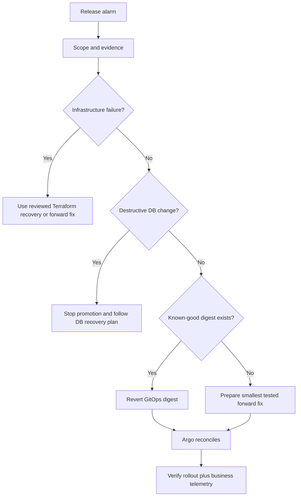

# CI/CD And GitOps Troubleshooting Playbook

This chapter is organized by symptom because production incidents begin with
evidence, not with a known root cause.

Do not memorize random commands. For every scenario, use the same sequence:

```text
scope -> recent change -> evidence -> failing boundary
      -> smallest safe fix -> rollback -> verification
```

## 1. First Five Questions

1. **Scope**: one commit, one service, one environment, or every pipeline?
2. **Timing**: when did it last work, and what changed since then?
3. **Boundary**: source, CI runner, artifact, registry, GitOps, Argo, Kubernetes,
   application, database, or dependency?
4. **Evidence**: what do logs, statuses, diffs, digests, and metrics say?
5. **Risk**: should we continue, pause promotion, or roll back immediately?

Never begin by rerunning everything. A rerun may hide a race or create a second
change while the first is still active.

## 2. Workflow Did Not Start

### Symptoms

- No GitHub Actions run exists.
- Jenkins received no build.
- The commit is visible in Git.

### Checks

GitHub Actions:

```bash
gh run list --workflow "Infra PR Validation" --limit 10
git diff --name-only origin/main...HEAD
```

Jenkins:

- inspect webhook delivery status;
- inspect multibranch indexing logs;
- confirm the branch source and Jenkinsfile path;
- verify repository credentials.

### Likely Causes

- `paths` filter did not match;
- workflow YAML is only on the PR branch and the event uses base-branch rules;
- workflow is disabled;
- fork PRs cannot access secrets;
- webhook signature or endpoint failed;
- multibranch scan has not discovered the branch;
- Jenkinsfile path changed.

### Fix

Correct the trigger or webhook. Do not manually deploy to bypass a missing
pipeline. Recreate the expected event or use a controlled manual dispatch with
the same gates.

### Verify

A new run exists for the expected commit SHA and shows the expected event.

### Speakable Answer

> I first distinguish a trigger failure from a job failure. If no run exists, I
> inspect path filters, event rules, fork-secret behavior, webhook deliveries,
> and branch discovery before looking at build logs.

## 3. Job Is Queued Or Runner Is Offline

### Symptoms

- GitHub job remains queued.
- Jenkins says "waiting for next available executor."
- No build step has started.

### Checks

- Is the requested runner or agent label correct?
- Is a self-hosted runner online and in the right group?
- Are all Jenkins executors occupied?
- Is autoscaling at its limit?
- Is a previous build holding a lock?
- Is the cloud quota exhausted?

Jenkins administrators also inspect queue reason, node health, disk, and agent
connection logs.

### Likely Causes

- label mismatch;
- runner group permission;
- offline agent;
- executor starvation;
- cloud agent provisioning failure;
- concurrency group or Jenkins lock;
- regional or account quota.

### Safe Fix

Repair capacity or labels. Cancel only obsolete builds. Do not add unlimited
executors to one machine because concurrent builds then compete for CPU, memory,
disk, and Docker.

### Verify

The job is assigned to the intended clean runner, and queue time returns to its
normal range.

## 4. Checkout Fails

### Symptoms

- authentication or repository-not-found error;
- detached or wrong revision;
- submodule failure;
- intermittent network timeout.

### Checks

```bash
git rev-parse HEAD
git remote -v
git submodule status
```

Confirm the pipeline checks out the event SHA, not merely the latest branch
head.

### Likely Causes

- token lacks repository access;
- GitHub App installation scope changed;
- deploy key expired or rotated;
- shallow clone lacks required history;
- submodule uses a different credential;
- branch was force-pushed.

### Safe Fix

Restore least-privilege repository access and pin the exact source revision.
Retry only if evidence shows a transient network failure.

### Verify

`git rev-parse HEAD` equals the commit shown by the CI event.

## 5. Maven Dependency Resolution Fails

### Symptoms

- `Could not resolve dependencies`;
- HTTP 401, 403, 429, or 5xx from Maven repository;
- checksum mismatch;
- build works locally but not in CI.

### Checks

```bash
./mvnw --batch-mode --no-transfer-progress -U dependency:go-offline
./mvnw --version
```

Inspect:

- Maven Wrapper version;
- `settings.xml` mirror and server IDs;
- repository credential scope;
- proxy and certificate chain;
- whether a dynamic dependency version was used;
- whether a poisoned cache is involved.

### Safe Fix

- fix repository authentication or mirror configuration;
- pin dependency and plugin versions;
- clear only the affected cache entry, not every cache by habit;
- restore from an approved artifact repository;
- do not bypass checksum validation.

### Verify

A clean runner resolves the same dependency set and produces the expected lock
or dependency report.

## 6. Unit Tests Are Flaky

### Symptoms

- rerun passes without source changes;
- failures depend on time, ordering, port, or environment;
- one test intermittently times out.

### Checks

- compare failing test names and duration across runs;
- inspect random seed, time zone, locale, and parallelism;
- look for shared static state;
- check external service dependencies;
- inspect CPU and memory pressure.

### Unsafe Response

Adding three automatic retries and calling the pipeline green.

### Better Response

1. quarantine only with ownership and expiry;
2. retain the failure evidence;
3. make test dependencies deterministic;
4. use fake clocks, isolated data, and unique resources;
5. track flaky-test rate as engineering debt.

### Verify

The test passes repeatedly on clean runners without retry masking.

## 7. Sonar Quality Gate Times Out

### Symptoms

- scan upload succeeded;
- pipeline waits at `waitForQualityGate`;
- no pass or fail result returns.

### Checks

- SonarQube server health;
- webhook from SonarQube to Jenkins;
- project key and analysis ID;
- background task queue;
- reverse proxy and TLS;
- scanner/server compatibility.

### Root-Cause Split

- If analysis itself failed, inspect scanner logs.
- If analysis completed but Jenkins still waits, inspect webhook delivery.
- If gate failed, inspect the new-code conditions rather than the integration.

### Verify

The exact analysis ID reaches a terminal quality-gate state and the pipeline
responds once.

## 8. Docker Build Works Locally But Fails In CI

### Symptoms

- file not found in build context;
- architecture-specific compile error;
- private dependency authentication failure;
- disk full;
- base image pull rate limit.

### Checks

```bash
docker buildx version
docker version
docker build --no-cache --progress=plain -f path/to/Dockerfile path/to/context
```

Inspect `.dockerignore`, case-sensitive paths, target platform, proxy, build
secrets, and available disk.

### Common Root Cause

The Dockerfile path and build context are confused. `COPY` reads only from the
build context, even if the Dockerfile lives elsewhere.

### Safe Fix

- correct context and `.dockerignore`;
- use BuildKit secret mounts, not `ARG` for secrets;
- pin base images by digest where assurance requires it;
- use multi-stage builds;
- avoid copying the entire repository unnecessarily.

### Verify

Build on a clean runner for the same target platform. Inspect resulting layers
and confirm secrets are absent.

## 9. ECR Login Or Push Returns AccessDenied

### Symptoms

- `no basic auth credentials`;
- `AccessDeniedException`;
- push starts but one layer is denied;
- wrong registry or repository.

### Checks

```bash
aws sts get-caller-identity
aws ecr describe-repositories --repository-names releaseops-dev/api
aws ecr get-login-password --region us-east-1
```

Check both:

1. **trust**: may this workload assume the role?
2. **permission**: what may the assumed role do?

Required ECR push permissions commonly include token retrieval, layer upload,
image availability checks, and `PutImage`.

### Likely Causes

- OIDC `sub` or `aud` trust condition does not match;
- role permission misses an ECR action;
- repository policy denies the principal;
- region or account is wrong;
- login went to a different registry hostname;
- credentials expired during a long build.

### Verify

The caller identity is the intended role, the image exists under the expected
repository, and the returned digest is recorded.

## 10. GitHub OIDC AssumeRole Fails

### Symptoms

- `Not authorized to perform sts:AssumeRoleWithWebIdentity`;
- `No OpenIDConnect provider found`;
- credential action cannot retrieve a token.

### Checks

- workflow job has `id-token: write`;
- IAM OIDC provider URL and audience;
- role trust policy `sub` condition;
- repository owner, repository, branch, tag, or environment claims;
- pull request versus main-branch subject shape.

### Important Distinction

An IAM permission policy cannot repair a failed trust policy. The principal has
not assumed the role yet.

### Safe Fix

Restrict trust to the expected repository and deployment context. Do not change
the subject condition to a broad wildcard merely to make the pipeline green.

### Verify

`aws sts get-caller-identity` shows the expected assumed-role session, and a
disallowed branch still fails.

## 11. Vulnerability Scan Fails

### Symptoms

- high or critical CVE blocks the image;
- finding is in the OS base layer or transitive Java dependency;
- no fixed version exists.

### Triage

Ask:

- Is the vulnerable component present and reachable?
- Is a fixed base image or dependency available?
- Is the finding newly introduced?
- Is there an exploit path?
- Is the scanner database current?
- Does an approved exception already exist?

### Safe Response

Preferred order:

1. upgrade the direct dependency;
2. override a vulnerable transitive dependency carefully;
3. update the base image;
4. remove the unused package;
5. use a time-bounded, owned exception only after risk review.

Never disable the scanner globally for one finding.

### Verify

Rebuild from trusted source, rescan the new digest, and confirm the exception
has not silently become permanent.

## 12. Pipeline Published The Wrong Image

### Symptoms

- tag points to an unexpected build;
- production runs source different from the approved commit;
- two pipelines pushed the same tag.

### Likely Cause

Mutable tags such as `latest`, branch names, or reused version numbers.

### Fix

- enable tag immutability in ECR;
- generate a unique source-derived tag;
- capture registry digest after push;
- promote the digest;
- prevent concurrent release jobs from publishing the same version.

### Verify

Compare:

```bash
aws ecr describe-images \
  --repository-name releaseops-dev/api \
  --image-ids imageTag=release-service-a1b2c3d4e5f6
```

Then compare the digest with GitOps and the live Pod image ID.

## 13. GitOps Promotion PR Has A Conflict

### Symptoms

- two releases edit the same values file;
- promotion branch cannot merge;
- older release may overwrite newer digest.

### Safe Fix

1. fetch latest desired-state branch;
2. determine which digest should win;
3. regenerate the change on the latest base;
4. retain environment concurrency;
5. never resolve by accepting both image values blindly.

The project promotion workflow uses an environment-and-service concurrency
group to serialize proposals.

### Verify

The final PR diff changes only the intended service and digest.

## 14. Argo Application Is OutOfSync

### Checks

```bash
argocd app get releaseops-dev-release-service
argocd app diff releaseops-dev-release-service
kubectl get deployment,service,configmap -n releaseops
```

### Root-Cause Categories

- approved Git change has not synced;
- someone manually changed the cluster;
- mutating admission controller changed a field;
- defaulted fields are compared differently;
- Helm render changed;
- Argo lacks permission;
- resource is ignored or excluded.

### Fix

Do not press Sync repeatedly before reading the diff. Identify whether Git or
live state is correct. Correct desired state, diff customization, ownership, or
RBAC.

### Verify

Application becomes Synced and remains Synced through another reconciliation
cycle.

## 15. Argo Is Synced But The Application Is Broken

### Meaning

Argo successfully matched manifests. It did not validate the business outcome.

### Checks

```bash
kubectl rollout status deployment/release-service -n releaseops
kubectl get pods -n releaseops -o wide
kubectl logs deployment/release-service -n releaseops --tail=200
kubectl get events -n releaseops --sort-by=.lastTimestamp
```

Then check:

- ingress and Service endpoints;
- readiness;
- application logs;
- RDS connection;
- SQS permissions and queue depth;
- external dependencies;
- error rate and latency;
- smoke transaction.

### Speakable Answer

> Synced is a desired-state statement, not a business-health statement. I
> continue through rollout, probes, endpoints, logs, dependencies, telemetry,
> and a representative transaction.

## 16. Rollout Times Out

### Symptoms

- Deployment ProgressDeadlineExceeded;
- new Pods are not Ready;
- old Pods remain;
- pipeline or Argo shows Degraded.

### Evidence Order

```bash
kubectl rollout status deployment/release-service -n releaseops --timeout=5m
kubectl describe deployment release-service -n releaseops
kubectl get rs,pods -n releaseops
kubectl describe pod <new-pod> -n releaseops
kubectl logs <new-pod> -n releaseops --previous
kubectl get events -n releaseops --sort-by=.lastTimestamp
```

### Common Causes

- `ImagePullBackOff`;
- readiness failure;
- crash loop;
- resource request cannot be scheduled;
- PDB or rollout strategy prevents progress;
- missing ConfigMap or Secret;
- bad ServiceAccount permission;
- node or volume issue.

### Safe Fix

Fix the failing boundary or revert desired state to the last known-good digest.
Do not delete every Pod first because that removes evidence and can increase
outage impact.

### Verify

New ReplicaSet reaches desired availability, old ReplicaSet scales down, and
telemetry recovers.

## 17. Database Migration Failed Mid-Release

### First Questions

- Was the migration transactional?
- Did it make destructive changes?
- Can the old application still read the schema?
- Did more than one migration Job run?
- Is the database locked?

### Checks

- migration Job logs and status;
- migration history table;
- RDS events and connections;
- lock and long-running query views;
- application compatibility;
- backup and restore readiness.

### Safe Response

Stop additional promotion. Do not repeatedly rerun a non-idempotent migration.
Choose among:

- resume an idempotent migration;
- apply a tested forward fix;
- roll back application only if schema remains compatible;
- restore data only through the approved recovery procedure.

### Interview Point

> Kubernetes rollback does not automatically roll back database state. I design
> backward-compatible migrations and separate destructive cleanup into a later
> release.

## 18. Jenkins Controller Restarted During A Build

### Symptoms

- stages pause or resume unexpectedly;
- agent workspace disappeared;
- pipeline step cannot be resumed;
- duplicate external operation is possible.

### Checks

- build durability setting;
- controller logs;
- agent status;
- whether an external push or deployment completed;
- pipeline stage and artifact evidence.

### Safe Fix

Make external operations idempotent. Before rerunning a push or promotion,
query ECR and Git to learn what already completed. Do not assume the whole stage
rolled back with Jenkins.

### Verify

One artifact digest and at most one intended promotion PR exist.

## 19. Jenkins Agent Disk Is Full

### Symptoms

- Docker reports no space left;
- checkout or archive fails;
- unrelated builds on one node begin failing.

### Checks

```bash
df -h
docker system df
du -sh "$WORKSPACE"
```

### Root Causes

- reused agents retain images and workspaces;
- artifact retention is too long;
- concurrent builds share small storage;
- cleanup never runs after aborted builds.

### Safe Fix

Prefer ephemeral agents. Set build and artifact retention. Clean workspaces in
`post { always { ... } }`. Prune only resources owned by the build platform,
not arbitrary shared Docker data.

### Verify

Disk alerts recover, new agents start clean, and retention behavior is tested.

## 20. Jenkins Shared Library Change Broke Many Repositories

### Symptoms

- many services fail at the same stage after no application changes;
- error references a library method or plugin step.

### Triage

- identify library version used by affected builds;
- compare with last successful version;
- check plugin and Jenkins core compatibility;
- inspect the library release change.

### Safe Fix

Pin consumers to the last known-good library version, revert the bad release,
then test the correction in a canary set of repositories.

### Prevention

- versioned library releases;
- compatibility tests;
- gradual rollout;
- changelog;
- deprecation window;
- emergency rollback.

## 21. GitHub Workflow Has Excessive Permissions

### Symptom

A scanner or security review flags `contents: write`, `packages: write`, or
`id-token: write` across every job.

### Risk

Compromised PR code or a third-party action gains privileges it does not need.

### Fix

Set workflow permissions to read-only, then grant narrowly scoped permissions
only to the job that publishes or opens a promotion PR.

Also:

- do not expose protected secrets to untrusted fork code;
- pin third-party actions;
- review action provenance;
- protect environment secrets;
- avoid executing PR-controlled shell text.

### Verify

PR test jobs cannot request AWS credentials or write repository content.

## 22. Workflow Input Causes Unexpected Shell Execution

### Symptom

A branch name, pull request title, notification message, or workflow input
changes the shell command that CI executes.

### Root Cause

Untrusted expression text was inserted directly into a `run` script:

```yaml
run: echo "${{ inputs.change-summary }}"
```

GitHub expands the expression before Bash parses the script. Shell characters
inside the input can therefore become syntax.

### Safe Pattern

Pass untrusted text through an environment variable:

```yaml
env:
  CHANGE_SUMMARY: ${{ inputs.change-summary }}
run: printf '%s\n' "${CHANGE_SUMMARY}"
```

Also validate fields that become paths, tags, branch names, or command
arguments. Never use `eval`.

### Verify

Test with spaces, quotes, dollar signs, semicolons, and newlines. The input must
remain data and must not create another command.

## 23. Terraform CI Plan And Apply Differ

### Symptoms

- reviewed plan showed one result;
- apply calculates another;
- infrastructure changed between stages.

### Causes

- apply reran `terraform plan`;
- state or configuration changed;
- provider version changed;
- plan artifact was not preserved;
- wrong workspace or backend key;
- manual drift occurred.

### Safe Pattern

1. pin Terraform and provider versions;
2. initialize the intended backend;
3. create a saved plan;
4. securely retain that exact plan;
5. review it;
6. apply the saved plan;
7. serialize operations for one state.

Remember that saved plan files may contain sensitive values. Restrict access and
retention.

## 24. Rollback Decision Tree



Rollback is a controlled release, not a panic button.

## 25. Incident Communication

A useful update contains:

```text
Impact:
Start time:
Affected service/environment:
Current hypothesis:
Evidence:
Mitigation in progress:
Rollback status:
Next update time:
Owner:
```

Avoid announcing an unverified root cause. Say "current hypothesis" until
evidence confirms it.

## 26. Scenario Answer Formula

For interview scenarios, use this speakable pattern:

> First I would establish scope and protect the environment from further
> promotion. Then I would inspect the evidence at the failing boundary rather
> than rerunning blindly. I would compare the current commit, artifact digest,
> GitOps desired state, Argo status, and live workload. Based on impact, I would
> either apply the smallest safe correction or revert to the last known-good
> digest. Finally I would verify technical and business health, document the
> cause, and add a prevention control.

## 27. Practice Questions

Answer each using symptom, evidence, cause, fix, rollback, and verification:

1. The image exists in ECR, but Argo never deploys it.
2. Argo is Synced and Healthy, but customers receive HTTP 500.
3. A production Pod uses a digest different from the promotion PR.
4. Jenkins waits for an executor for 25 minutes.
5. GitHub OIDC works on `main` but fails from a protected environment.
6. Sonar analysis completes, but Jenkins times out.
7. A CVE has no vendor fix and the release is urgent.
8. Two releases open conflicting GitOps PRs.
9. A rollback restores Pods but database errors continue.
10. A Shared Library update breaks 30 repositories.
11. Terraform apply differs from the approved plan.
12. Manual `kubectl edit` is repeatedly reversed.
13. A pull request title is interpolated directly into a shell command.

Do not claim these invented scenarios as personal incidents. In an interview,
say, "My approach in that scenario would be..." and then walk through the
evidence-based response.
